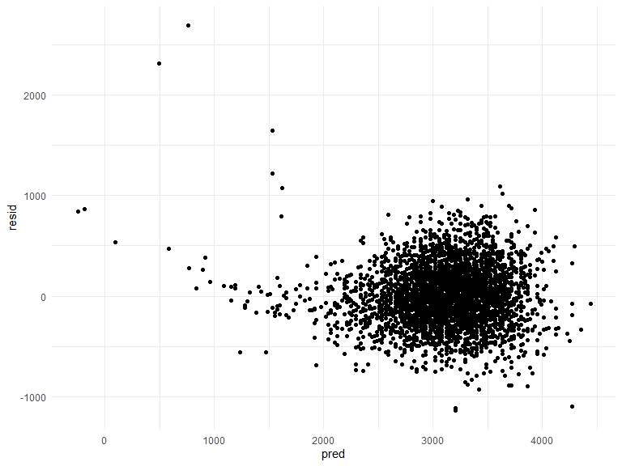
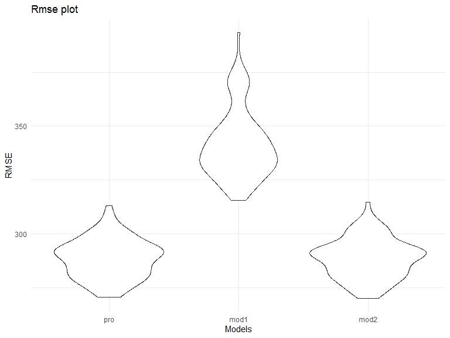
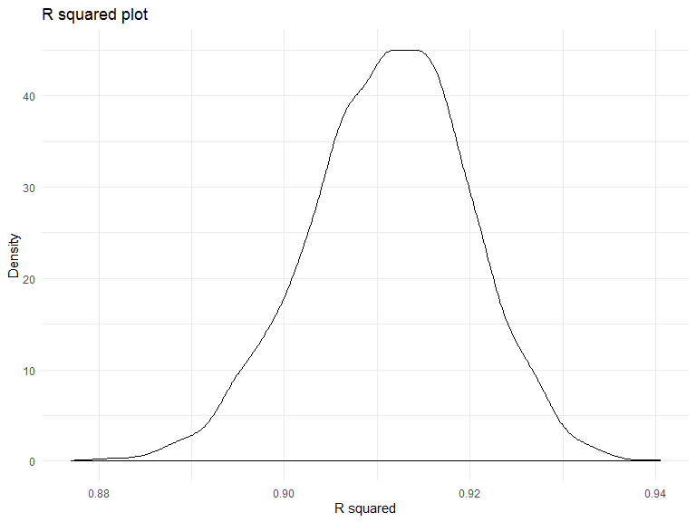
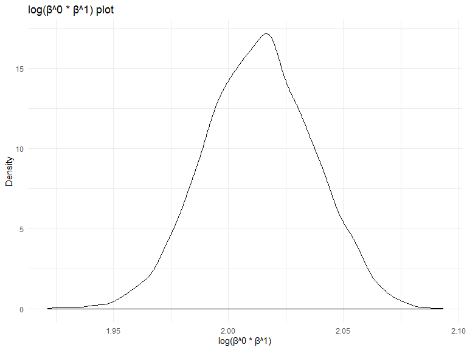

p8105\_hw6\_jf3286.Rmd
================
Jingyu Fu
2019/11/19

# Problem 1

Load and clean the data for regression analysis. I converted numeric to
factor, checked for missing data.

``` r
data1 = read_csv(file = "./data/birthweight.csv") %>% 
  janitor::clean_names() %>% 
  mutate(
   babysex = as.character(babysex),
    babysex = fct_infreq(babysex),
   frace = as.character(frace),
    frace = fct_infreq(frace),
    malform = as.character(malform),
    malform = fct_infreq(malform),
   mrace = as.character(mrace),
    mrace = fct_infreq(mrace)
  )
```

    ## Parsed with column specification:
    ## cols(
    ##   .default = col_double()
    ## )

    ## See spec(...) for full column specifications.

``` r
sum(is.na(data1))
```

    ## [1] 0

Propose a regression model for birthweight.

``` r
pro_mod = lm(bwt ~ babysex + bhead + blength, data = data1)
```

Making a plot.

``` r
data11 = data1 %>% 
  modelr::add_residuals(pro_mod) %>% 
   add_predictions(pro_mod) 
   
data11 %>% 
    ggplot(aes(x = pred, y = resid)) + geom_point()
```



Description: according to the common aknowledge about factors that may
effect birthweight, the most closely relevant factors would be baby’s
sex, head cricumference, and length at birth.

Compare my model to two others:

``` r
cv_df1 =
  crossv_mc(data1, 100) %>% 
  mutate(
    train = map(train, as_tibble),
    test = map(test, as_tibble))


cv_df11 = 
  cv_df1 %>% 
  mutate(pro_mod  = map(train, ~lm(bwt ~ babysex + bhead + blength, data = .x)),
         mod1  = map(train, ~lm(bwt ~ babysex + blength, data = .x)),
         mod2  = map(train, ~lm(bwt ~ babysex * bhead * blength, data = .x))) %>% 
  mutate(rmse_pro = map2_dbl(pro_mod, test, ~rmse(model = .x, data = .y)),
         rmse_mod1 = map2_dbl(mod1, test, ~rmse(model = .x, data = .y)),
         rmse_mod2 = map2_dbl(mod2, test, ~rmse(model = .x, data = .y)))

cv_df11 %>% 
  select(starts_with("rmse")) %>% 
pivot_longer(
    everything(),
    names_to = "model", 
    values_to = "rmse",
    names_prefix = "rmse_") %>% 
  mutate(model = fct_inorder(model)) %>% 
  ggplot(aes(x = model, y = rmse)) + geom_violin()
```



Comparison: From the violin plot of rmse vs model, we can tell that
model 2 is the best model (bwt \~ babysex \* bhead \* blength), the one
using head circumference, length, sex, and all interactions (including
the three-way interaction) between these.

# Problem 2

Load in the data.

``` r
weather_df = 
  rnoaa::meteo_pull_monitors(
    c("USW00094728"),
    var = c("PRCP", "TMIN", "TMAX"), 
    date_min = "2017-01-01",
    date_max = "2017-12-31") %>%
  mutate(
    name = recode(id, USW00094728 = "CentralPark_NY"),
    tmin = tmin / 10,
    tmax = tmax / 10) %>%
  select(name, id, everything())
```

    ## Registered S3 method overwritten by 'crul':
    ##   method                 from
    ##   as.character.form_file httr

    ## Registered S3 method overwritten by 'hoardr':
    ##   method           from
    ##   print.cache_info httr

    ## file path:          C:\Users\mac\AppData\Local\rnoaa\rnoaa\Cache/ghcnd/USW00094728.dly

    ## file last updated:  2019-09-26 02:13:17

    ## file min/max dates: 1869-01-01 / 2019-09-30

Use 5000 bootstrap samples and, for each bootstrap sample, produce
estimates of these two quantities.

``` r
weather1 = weather_df %>% 
  modelr::bootstrap(n = 5000) 


weather11 = weather1 %>% 
  mutate(
    models = map(strap, ~lm(tmax ~ tmin, data = .x) ),
    results = map(models, broom::glance)) %>% 
select(-strap, -models) %>% 
  unnest(results) %>% 
  select(.id, r.squared) %>% 
  janitor::clean_names()


weather12 = weather1 %>% 
  mutate(
    models = map(strap, ~lm(tmax ~ tmin, data = .x) ),
    results = map(models, broom::tidy)) %>%  
select(-strap, -models) %>% 
  unnest(results) %>% 
  select(.id,term,estimate) %>% 
  group_by(.id) %>% 
  pivot_wider(
    names_from = term,
    values_from = estimate
  ) %>% 
  janitor::clean_names() %>% 
  ungroup()
  
weather121 = weather12 %>% 
  group_by(id) %>% 
mutate(
    logb = log(intercept * tmin)
  )
```

Plot the distribution of my estimates, and describe these in words.

``` r
weather11 %>% 
ggplot(aes(x = r_squared)) +
 geom_density()
```



``` r
weather121 %>% 
  ggplot(aes(x = logb)) +
 geom_density()
```


Description: Both plots have left tails, and a bit skewed. Therefore
strict normality doesn’t apply to those two estimates.

Using the 5000 bootstrap estimates, identify the 2.5% and 97.5%
quantiles to provide a 95% confidence interval for r^2.

``` r
quantile(pull(weather11, r_squared),c(.025,.975))
```

    ##      2.5%     97.5% 
    ## 0.8936977 0.9274807

Therefore, the 95% confidence interval for r^2 is (0.8936877,
0.9274807).

Identify the 2.5% and 97.5% quantiles to provide a 95% confidence
interval for log(β<sup>0∗β</sup>1).

``` r
quantile(pull(weather121, logb),c(.025,.975))
```

    ##     2.5%    97.5% 
    ## 1.966942 2.058528

Therefore, the 95% confidence interval for log(β<sup>0∗β</sup>1) is
(1.966942, 2.058528).
